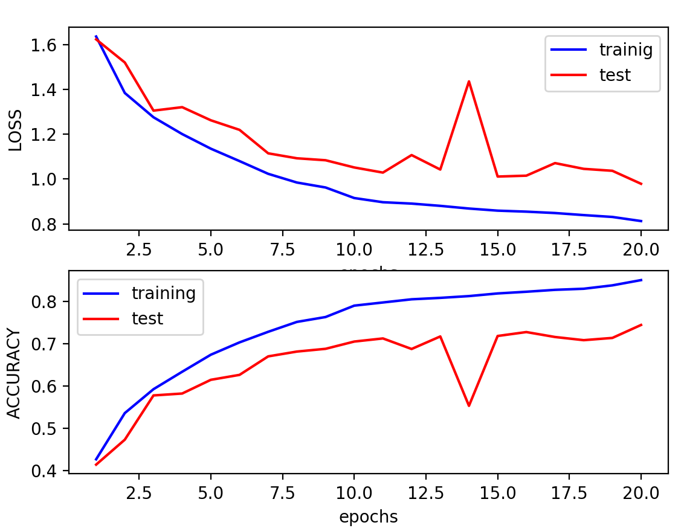

# Binarized Neural Network 

Tensorflow framework and Python_3 are required; we trained the network over 2 types of dataset: MNIST and CIFAR-10

For each dataset we will implement: 
  1) A binarized neural network with original batch normalizzation 
  2) A binarized neural network with shift based batch normalizzation.

The default optimizer is the Vanilla Adam, also we improved the network with a particular extension optimization, the Shift Based AdaMax. 

In the end it's possible to plot graphics about accuracy and loss of the trained network.

# Documentation
 See the [report](./Report.pdf)

# Cifar dataset

# MNIST dataset

# Partial Results (sbn adamax)

All results are in the report
